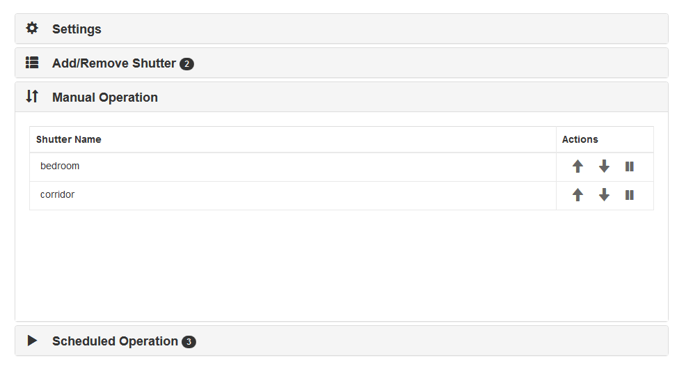

# Pi-Somfy

## 1 Overview

This project allows to operate multiple Somfy shutters using the **RTS protocol** from a Raspberry Pi with cheap hardware costing less than $2. It comes with a command line interface, a web interface and an Amazon Alexa interface. 

## 2 Hardware

This project has been developed and tested with a Raspberry Pi B+ and a Raspberry Pi 3 as the base platforms. Since the serial port and network are the only external ports used, the program could be used on other platforms with minor modifications and testing.

Wi-Fi connectivity and Ethernet cable should both work. Note that the hardware has to be reasonably close (i.e. in the same house or in the same aisle of your mansion: just like a physical remote) to the shutters you operate, as the signal strength will otherwise not be sufficient.

As of now, you have to build your own hardware. Here are the steps to do so.
1. You need the RF Transmitter. If you wish to order it from eBay, this link maybe helpful: <br/>[Order](https://www.ebay.com/sch/sis.html?_nkw=5x+433Mhz+RF+transmitter+and+receiver+kit+Module+Arduino+ARM+WL+MCU+Raspberry).<br/>Note that desoldering a 3 pin component isn't trivial, so ordering more than one may be a good idea in case of a screw up.
1. You need an oscillator for a 433.42 MHz frequency. The above RF transmitter comes with a common 433.93 MHz one, which will not work with your Somfy shutter. If you wish to order it from eBay, this link maybe helpful: <br/>[Order](https://www.ebay.com/sch/sis.html?_nkw=433.42M+R433+F433+SAW+Resonator+Crystals+TO-39)
1. You will need cables to connect the transmitter to the Raspberry Pi. Any cable will do obviously, but I found these quite helpful. <br/>[Order](https://www.ebay.com/itm/40Pin-Multicolored-Dupont-Wire-Kits-Breadboard-Female-Jumper-Ribbon-Cable/113310899442)
1. OPTIONAL: If you intend to place your Raspberry Pi further than about 10 ft from your receiver (aka your shutter or awning), you may need an antenna. Literally any 17 cm solid core copper wire will do the job. But if you prefer to order a fancy full one, this one will come handy <br/>[Order](https://www.ebay.com/itm/10pcs-433MHz-antenna-Helical-antenna-Remote-Control-for-Arduino-Raspberry-pi/372691762881?hash=item56c628fec1:g:kf0AAOxyBPZTgvGe)

Once you have all the hardware handy, it's now time to swap the oscillator, which requires a bit of soldering. Reason for this is that the emitter you bought uses a common 433.93 MHz frequency, Somfy however requires a 433.__42__ MHz frequency. Take the following steps to exchange the oscillator
1. Identify the oscillator. It looks like this (marked with a red circle): <br/>. <br/>Turn the RF Transmitter around. You will see that the oscillator is soldered in on 3 points <br/>
1. While pulling the oscillator from the front, heat up the 3 soldering point on the back with the soldering iron until the oscillator is detached from the board
1. Clean up the remaining solder mess on both desoldering braid or a desoldering pump
1. Now put in the new oscillator (make sure all 3 pins connect through the print) and solder it in again
1. Solder an antenna to the ANT pad. The ideal is a 17 cm solid core wire but almost anything will do the job. I used this antenna from ebay ([Order](https://www.ebay.com/itm/10pcs-433MHz-antenna-Helical-antenna-Remote-Control-for-Arduino-Raspberry-pi/372691762881?hash=item56c628fec1:g:kf0AAOxyBPZTgvGe)) as I like the outlook. If your Pi is less than 10 ft from the receiver, it may work without antenna.

And you are done on the mods!

Now the last step is to connect your adjusted RF transmitter to your Raspberry Pi. Use the following diagram to help you connect it 


Note that I used GPIO 4 but you can change the value of __TXGPIO__ to whatever you want if you choose a different way to connect your RF emitter. This is a configuration parameter in operateShutters.conf.

OK. now this all should look like this. Note that some of the pictures are a bit confusing with regards to which GPIO a cable connects to. It's easier to see on the above diagram. But if you struggle, maybe the [Wiring Diagram](documentation/Wiring%20Diagram.txt) helps.


<br/>
<br/>
<br/>

## 3 Software

If you are new to using a Raspberry Pi and Linux please refer to other sources for coming up to speed with the environment. Having a base knowledge will go a long way. This [site](https://www.raspberrypi.org/help/) is a great place to start if you are new to these topics.

If you are not familiar with remote login commands for Linux/Unix, two useful commands if you are not using a GUI on your raspberry pi are "ssh" and "scp". These commands allow you to run your Pi without a monitor or user interface. These programs allow you to remotely login to your Pi and remotely transfer files to your Pi. This [page](https://linuxacademy.com/blog/linux/ssh-and-scp-howto-tips-tricks/) describes both programs. You can also do a web search on these programs to find other resources on their use. In short you need to have at minimum a basic understanding of using a command line, preferably some experience with Linux and the ability to transfer files to a Raspberry Pi and execute them.

The Raspberry Pi organization has documentation on installing an operating system on your Raspberry Pi. It is located [here](https://www.raspberrypi.org/documentation/installation/installing-images/README.md).

One the Pi has its basic setup (an operating system and an internet connection) working, ssh into your Raspberry Pi and you should find that you are in the directory /home/pi. Note: if you prefer not to use a headless system, you can also open a terminal windows directly on the Pi.

The next step is to download the Pi-Somfy project files to your Raspberry Pi. The easiest way to do this is to use the "git" program. Most Raspberry Pi distributions include the git program (except Debian Lite).

Whether or not it is already installed, it's good practice to type the following:

```sh
sudo apt-get update
sudo apt-get install git
```
(If git isn't installed, it will install it; if it was previously, it will update it)

Once git is installed on your system, make sure you are in the /home/pi directory, then type:

```sh
git clone https://github.com/Nickduino/Pi-Somfy.git
```

The above command will make a directory in /home/pi named Pi-Somfy and put the project files in this directory.

Next, we need to install Python Libraries. Before doing so, you have to decide whether you want to run Pi-Somfy in Python 2 or Python 3. The library supports both, but Python 3 is suggested. So, to proceed in Python 3, you need to ensure pip3 is installed: 

If the program 'pip3' is not installed on your system, type:

```sh
sudo apt-get update
sudo apt-get install python3-pip
```
    
If you decided to use Python 2, the last command will read instead:

```sh
sudo apt-get install python-pip
```

Next, we need to install the PIGPIO libraries, to do so, type:

```sh
sudo apt-get install pigpio
```

Next install the required Python Libraries:

```sh
sudo pip3 install -r requirements.txt
```
   
If you decided to use Python 2, the last command will read instead:

```sh
sudo pip install -r requirements.txt
```

Next, let's test if it all works. Start <operateShutters.py> by typing:

```sh
sudo python3 /home/pi/Pi-Somfy/operateShutters.py
```

You should see the help text explaining the [Command Line Interface](documentation/p4.png)

## 4 Usage

Note that the config file won't exists the first time you run the application. In that case, a new config file will be created based on the name you specified (e.g. /home/pi/Pi-Somfy/operateShutters.conf). Once it has been created, you can modify it to change your need (SSL or not, which port is used, etc.), it will not be erased with an update. If you messed up something, just delete it and relaunch operateShutters.py, a new vanilla copy will be generated.

You have 6 ways to operate. The recommended operation mode is mode 5. But the other 5 modes are explained here for completeness:

1. Command line Interface<br/>You can use either of the following commands to operate a shutter called<br/>

**Arguments:**

    shutterName                             Name of the shutter
    -h, --help                              Show this help message and exit
    -c CONFIGFILE, --config CONFIGFILE      Name of the config File (incl full Path)
    -up, -u                                 Raise the shutter
    -down, -d                               lower the shutter
    -stop, -s                               Stop the shutter
    -program, -p                            Send a program signal
    -press BTN [BTN...]                     Simulate a chord press of a the specified remote buttons
                                            ('up', 'down', 'stop'/'my', and 'program')
    -long                                   When used with the -press option, simulates a long press
    -demo                                   lower the shutter, stop after 7 second then raise the shutter
    -duskdawn DUSKDAWN DUSKDAWN, -dd DUSKDAWN DUSKDAWN
                                            Automatically lower the shutter at sunset and rise the
                                            shutter at sunrise, provide the evening delay and
                                            morning delay in minutes each
    -auto, -a                               Run schedule based on config. Also will start up the web-server 
                                            which can be used to setup the schedule.
    -echo, -e                               Enable Amazon Alexa (Echo) integration
    -mqtt, -m                               Enable MQTT integration


**Examples:**
All three command the shutter named corridor. The first one will raise it. The second one will lower it. The third one will lower the shutter at sunset and raise it again 60 minutes after sunrise.
```sh
sudo /home/pi/Pi-Somfy/operateShutters.py corridor -c /home/pi/Pi-Somfy/operateShutters.conf -u
sudo /home/pi/Pi-Somfy/operateShutters.py corridor -c /home/pi/Pi-Somfy/operateShutters.conf -d
sudo /home/pi/Pi-Somfy/operateShutters.py corridor -c /home/pi/Pi-Somfy/operateShutters.conf -dd 0 60
``` 

2. Manually start Web interface only<br/>You can start the web-interface by typing:<br/>Once started, you can access the web interface at http://IPaddressOfYouPi:80. From there you can further modify your settings.   
```sh
sudo python3 /home/pi/Pi-Somfy/operateShutters.py -c /home/pi/Pi-Somfy/operateShutters.conf -a 
```    

3. Manually start Web interface and Alexa interface<br/>You can start the web-interface by typing:
```sh
sudo python3 /home/pi/Pi-Somfy/operateShutters.py -c /home/pi/Pi-Somfy/operateShutters.conf -a -e
```    

4. Manually start Web interface and MQTT integration (for Home Assistant)<br/>You can start the web-interface by typing:
```sh
sudo python3 /home/pi/Pi-Somfy/operateShutters.py -c /home/pi/Pi-Somfy/operateShutters.conf -a -m
```    

5. Finally, the recommended way to operate it is using a systemd service on boot time. You can do so by typing:
```sh
sudo bash /home/pi/Pi-Somfy/installService.sh
```
The service will be installed as a system service right after establishing network connectivity.
If you want to stop the service simply type:
```sh
sudo systemctl stop shutters.service
```  
If you want to start the service simply type:
```sh
sudo systemctl start shutters.service
```  
If you want to restart the service simply type:
```sh
sudo systemctl restart shutters.service
```  
Note, currently the service expects python3 for starting up. 
If you went the python 2.7 path change the following line in shutters.service file before your installation
```
ExecStart=sudo /usr/bin/python3 /home/pi/Pi-Somfy/operateShutters.py -c /home/pi/Pi-Somfy/operateShutters.conf -a -e -m
```
to
```
ExecStart=sudo /usr/bin/python2.7 /home/pi/Pi-Somfy/operateShutters.py -c /home/pi/Pi-Somfy/operateShutters.conf -a -e -m
```

6. Finally, the recommended way to operate it is using a systemd service on boot time. You can do so by typing:
```sh
sudo crontab –e 
```
Note, that "crontab -e" will just open a console-based text editor that you can edit the crontab script. The first time you run "crontab -e" you will be prompted to choose the editor. I recommend nano. From the crontab window, add the following to the bottom of the crontab script

```
@reboot sleep 60;python3 /home/pi/Pi-Somfy/operateShutters.py -c /home/pi/Pi-Somfy/operateShutters.conf -a -e -m
0 * * * * python3 /home/pi/Pi-Somfy/operateShutters.py -c /home/pi/Pi-Somfy/operateShutters.conf -a -e -m
```

And save the crontab schedule. (if using nano type press ctrl-o to save the file, ctrl-x to exit nano). Now, every time your system is booted operateShutters will start.

The program is not known to crash. Hence restarting it every hour is not really required. But it does not hurt either. So up to you if you wish to use both of the above lines or just the first one. In any case, you will need to restart your Raspberry Pi once you have completed step 4. To do so, type "sudo reboot". 

To stop the program from running in the background, type:

```sh
sudo pkill –f operateShutters.py
```

## 5 Web GUI

Using your web-browser, navigate to: http://IPaddressOfYouPi:80

First time you use the Web GUI, it's important that you follow these 3 steps:

1. Set up your location. This is required to correctly determine the time of sunrise and sunset. To do so, navigate to the top menu item "Settings". Use the map to pinpoint your location. You can also use the search functionality on the left-hand side (magnifier icon) and type your address. Press "Save"

1. You will need to set up your shutters and program your remote control. To do so, select the second menu item "Add/Remove Shutters". <br/><br/>
Click the "Add" button, select the name for your shutter (this is also the name that the Amazon Alexa app will use later) and click on the "save" icon. Then follow the on-screen instructions for programming your shutter. For installing shutters from the factory default configuration, use the Configure button.

1. Next, make sure your shutters work. The easiest way to verify is to use the "Manual Operations" menu. <br/><br/> You can rise and lower your shutters by clicking on the relevant icons.

1. Finally, it's time to program your shutters schedule. To do so, use the "Scheduled Operations" menu. <br/><br/>


## 6 Alexa Integration

Before you can use the Amazon Alexa integration, you need to make sure you set up all shutters, by using "Add/Remove Shutters" in the Web GUI. **Amazon Alexa does not automatically discover new or amended shutters you have added**. 

So once all your shutters are set up and testing on the Web GUI, go to your Echo speaker and ask Alexa to discover your device. Say, "Discover my devices," or select Add Device in the Devices section of the Alexa app.

Once Alexa has discovered your shutters, you can use the Alexa app to complete the setup. 

To lower your shutter via the Echo speaker, say "Alexa, turn on {SHUTTERNAME}". And to rise the shutter again, say “Alexa, turn off {SHUTTERNAME}".

If you prefer to state the likes of "Alexa, OPEN the shutter" or "Alexa, CLOSE the shutter" (rather than using the words ON or OFF), you can set up a Routine with Alexa.

## 7 MQTT Integration (e.g. for Home Assistant)

While the MQTT integration was written specifically for [Home Assistant](https://www.home-assistant.io/), nothing is stopping the use of this integration for other purpose. But more on this later

First, to use this integration, make sure you configure your `operateShutters.conf` with the right parameters. Look out for the following lines:

```
MQTT_Server = 192.168.1.x
MQTT_Port = 1883
MQTT_User = xxxxxxx
MQTT_Password = xxxxxxx
```
and make sure they match the setup of you MQTT Broker. If you are using Home Assistant, you can conveniently use the "Mosquitto broker" add-on inside Home Assistant. For more information refer to the relevant [Documentation](https://github.com/home-assistant/hassio-addons/tree/master/mosquitto)

If you choose not to use the Home Assistant add-in, you can download the [Mosquitto Broker](https://mosquitto.org/) and refer to the [Broker configuration](https://mosquitto.org/man/mosquitto-8.html)

Second start `operateShutter.py` with the "-m" option. This should look similar to this:

```sh
operateShutters.py -c /home/pi/Pi-Somfy/operateShutters.conf -a -m
```

And that's it, you are all set. 

So if you use Home Assistant, you have 2 options:

### a.) you use Home Assistant's [MQTT Discovery functionality](https://www.home-assistant.io/docs/mqtt/discovery/). 

To do so, add the following line to `operateShutters.conf`

```
EnableDiscovery = true
```

and also add the following line to your `configuration.yaml` in Home Assistant:

```
mqtt:
  discovery: true
```
   
Note that both Pi-Somfy & Home Assistant need to be restarted before this will work. Home Assistant will henceforth auto discover any new  shutters you add

### b.) Don't use Home Assistants MQTT Discovery functionality.

If so, no further changes are required to `operateShutters.conf`. However you will have to add the following lines to `configuration.yaml` in Home Assistant for ever shutter you have (replace 0x2670xx with the shutters actual RTS_Address, which you can get from your `operateShutters.conf` file): 

```
cover:
   - platform: mqtt
     name: '{SHUTTERNAME}'
     payload_open: 100
     payload_close: 0
     command_topic: 'somfy/0x2670xx/level/cmd'
     position_topic: 'somfy/0x2670xx/level/set_state'
     set_position_topic: 'somfy/0x2670xx/level/cmd'
     state_open: 100
     state_closed: 0
```

And that's it! 

Finally, in case of any difficulties with this integration, 2 more useful commands:

### a.) See messages on the MQTT Broker
If you want to see what messages are passed on the MQTT Broker, you can use the following to listen to all messages (assuming you set up mosquitto with a username and password):

```
mosquitto_sub -h 192.168.x.x -p 1883 -u [username]-P [password] -t '#' -v
```

### b.) Send messages to the MQTT Broker, for Pi-Somfy to pick up
If you want to post a message to the MQTT Broker for your Pi-Somfy to pick up, you can use following to send messages (assuming you set up mosquitto with a username and password):

```
mosquitto_pub -h 192.168.x.x -p 1883 -u [username]-P [password] -t 'somfy/0x2670xx/level/cmd' -m '0'
mosquitto_pub -h 192.168.x.x -p 1883 -u [username]-P [password] -t 'somfy/0x2670xx/level/cmd' -m '100'
```

Those 2 command will lower and rise your shutters.

## 8 Credits
This Library was ported from [Arduino sketch](https://github.com/Nickduino/Somfy_Remote) onto the Pi by @Nickduino to open and close his blinds automatically. 

If you want to learn more about the Somfy RTS protocol, check out [Pushtack](https://pushstack.wordpress.com/somfy-rts-protocol/). 


## 9 License


[Attribution-NonCommercial-ShareAlike 4.0 International (CC BY-NC-SA 4.0)](https://creativecommons.org/licenses/by-nc-sa/4.0/)
